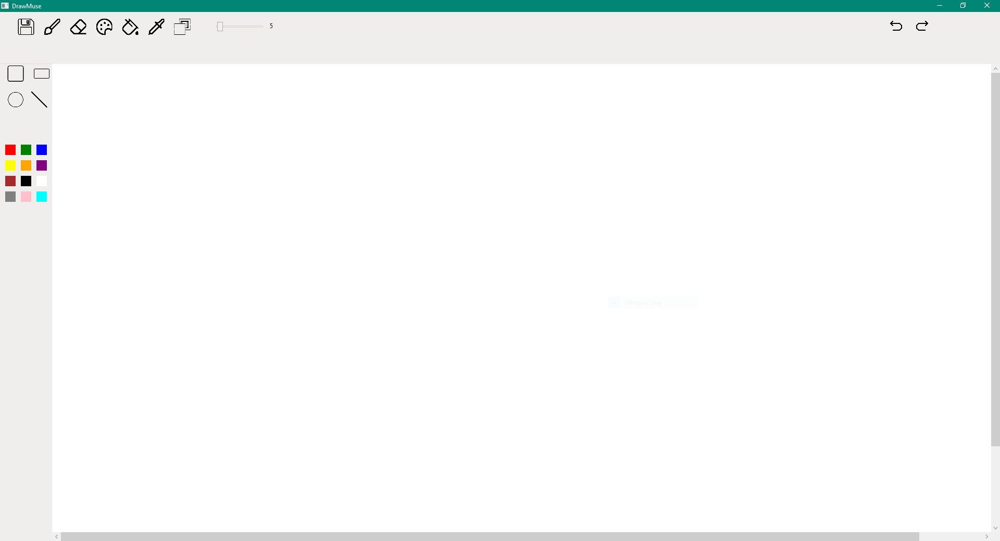
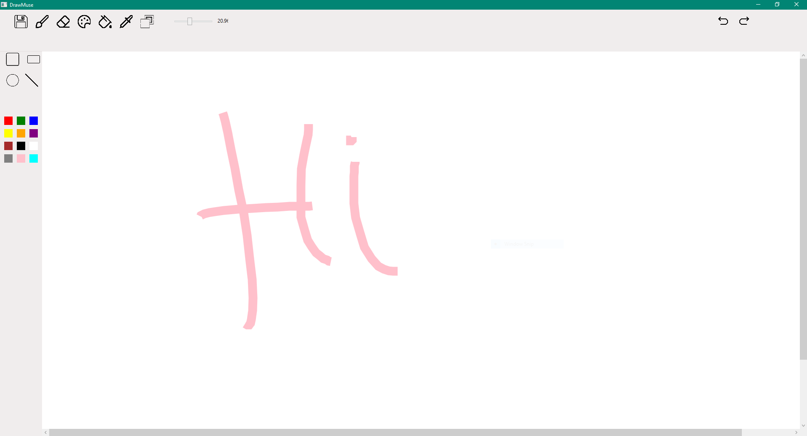

# DrawMuse

**DrawMuse** is a feature-rich drawing application developed using WPF in C#. It allows users to create digital artwork with various drawing tools.

## Technologies Used
- C#
- WPF (Windows Presentation Foundation)
- XAML

## Installation
1. Clone the repository:
   ```bash
   git clone https://github.com/Eli-Zaib/DrawMuse.git
2. Open the solution in Visual Studio.
3. Build and run the project.



## Features
- **Multiple Drawing Tools:** Pencil, Eraser, Shapes, and more.
- **Color Palette:** Customizable colors with a color picker and preset palettes.
- **Undo/Redo:** Supports full undo and redo of all actions.
- **File Management:** Save your artwork in various formats.
- **Bucket Fill Tool:** fill based on canvas areas.
- **Eyedropper Tool:** Pick colors directly from the canvas.


